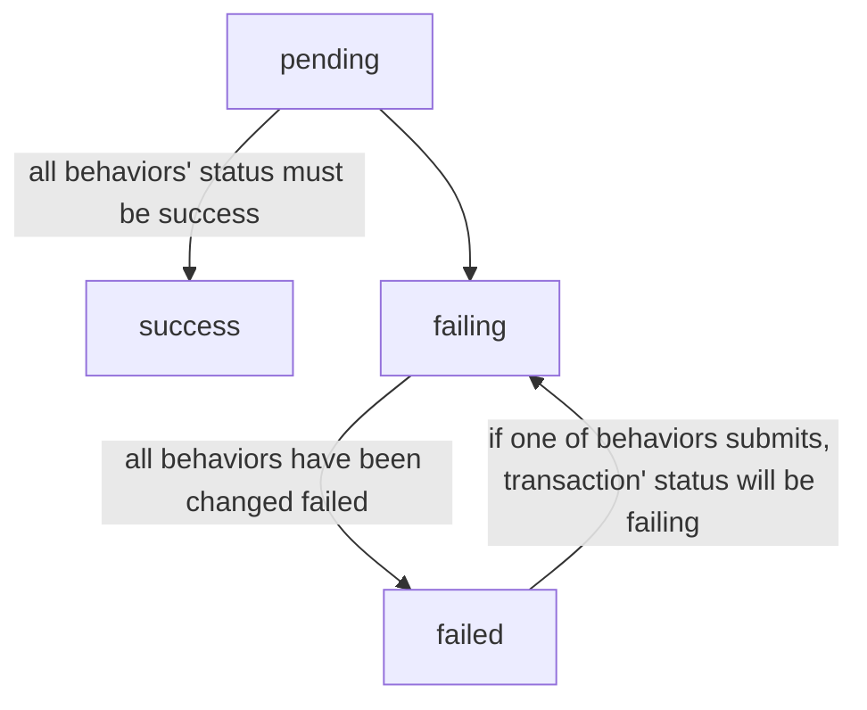

## 原则
* 一个事务里所调用的所有服务返回结果对其他事务都是透明的
>比如扣库存，库存服务方只能得到当前transactionId，而不能得到订单号，如果想要订单号，那么后期可以到调取事务清单
* 各个服务方只需要提供补偿动作、错误状态、成功状态，要求状态格式统一
>如果第三方服务不提供补偿服务，需要自己再建个服务，然后自己实现补偿动作，该动作记录手工该处理的异常
## Client接口
### 提交事务清单
>该接口一般业务发起方提供
##### path
_transaction/submitTransaction_
##### param
参考TD对象
##### response
```json
{
  "transactionId": "550e8400-e29b-41d4-a716-446655440000"
}
```

### 获取事务状态
>根据transactionId获取事务状态，需要先判断该事务是否是有效状态，再去执行action
##### path
_transaction/getTransactionStatus_

##### param
```json
{
  "transactionId": 1001
}
```
##### response
```json
{
  "status": "pending"
}
```


### 提交行为清单
>该提交如果失败(服务方超时，服务方返回错误)，本地必须处理，要么本地补偿，要么最终成功提交
##### path
_transaction/submitBehavior_

##### param
参考BD对象
##### response
```json
{
  "behaviorId": "091838e12-e29b-41d4-a716-446655447777"
}
```

# 对象
#### 事务清单 TD(transaction detail)
```json
{
  "transactionId": "091838e12-e29b-41d4-a716-446655447777",
  "name": "submitOrder",
  "status": "pending",
  "behaviors": [
    "createOrder",
    "debitMoney",
    "debitProduct",
    "exchangeCoupon"
  ],
  "expire": 30000,
  "time": "2022-03-10 10:00:01"
}
```
| 名称            | 位置   | 类型       | 必选  | 说明                        |
|---------------|------|----------|-----|---------------------------|
| transactionId | body | integer  | 是   | 事务id                      |
| name          | body | string   | 是   | 事务名称，预定义                  |
| status        | body | string   | 是   | 状态：pending,success,failed |
| expire        | body | integer  | 是   | 过期时间，单位毫秒                 |
| time          | body | datetime | 是   | 发生时间，待优化                  |
| behaviors     | body | [string] | 是   | 行为清单，预定义                  |

#### 行为清单 BD(behavior detail)
```json
{
  "transactionId": "091838e12-e29b-41d4-a716-446655447777",
  "name": "createOrder",
  "consistency": "compensate",
  "status": "ok",
  "time":"2022-03-10 10:00:01",
  "action": [
    {
      "name": "createOrder",
      "execute": {
        "path": "http://domain/createOrder",
        "header": {},
        "param": {
          "transactionId": 1001,
          "userId": 89,
          "productId": 12188
        }
      },
      "compensate": {
        "path": "http://domain/removeOrder",
        "header": {},
        "param": {
          "transactionId": 1001,
          "orderId": 20090
        }
      }
    }
  ]
}
```
| 名称                | 位置   | 类型       | 必选  | 说明                        |
|-------------------|------|----------|-----|---------------------------|
| transactionId     | body | string   | 是   | 事务id                      |
| behaviorId        | body | string   | 是   | 行为id                      |
| name              | body | string   | 是   | 行为名称                      |
| consistency       | body | string   | 是   | 一致性描述：compensate,execute  |
| status            | body | string   | 是   | 状态：success,failing,failed |
| time              | body | string   | 是   | 发生时间，待优化                  |
| action            | body | [object] | 是   | 动作                        |
| » name            | body | string   | 是   | 动作名称                      |
| » execute         | body | object   | 是   | 已执行，等效于http触发动作           |
| »» path           | body | string   | 是   | 路径                        |
| »» header         | body | object   | 是   | 头部                        |
| »»» transactionId | body | string   | 是   | 分布式事务Id                   |
| »» param          | body | object   | 否   | 示例参数                      |
| »»» userId        | body | integer  | 是   | 示例值                       |
| »»» productId     | body | integer  | 是   | 示例值                       |
| » compensate      | body | object   | 是   | 补偿名称，与execute互补           |
| »» path           | body | string   | 是   | 路径                        |
| »» header         | body | object   | 是   | 头部                        |
| »»» transactionId | body | string   | 是   | 分布式事务Id                   |
| »» param          | body | object   | 是   | 示例参数                      |
| »»» orderId       | body | string   | 是   | 示例值                       |

#### TP(transaction processor)
#### BP(behavior processor)



#### Success

#### Fail
* After one of behaviors failed, it will send a message A which compose of BD primarily with failing status.
* TP gets A,and save BD and send some messages ...B,then changes the status of this TD to failed.
* BP gets these messages ...B,then execute or compensate these BD which be included into ...B,Meanwhile it will change the status of these behaviors to failed which the status may be success or failing.


```json
[
  {
    "transactionId": "f2e65fc5-8177-4794-abbc-77cac5716725",
    "consistency": "compensate",
    "name": "createOrder",
    "execute": [
      "GET",
      "http://192.168.175.128:9501/order/createOrder",
      {
        "query": {
          "productId": "123123",
          "number": "30",
          "userId": 90
        },
        "headers": {
          "transactionId": "f2e65fc5-8177-4794-abbc-77cac5716725"
        }
      }
    ],
    "compensate": [
      "GET",
      "http://192.168.175.128:9501/order/createOrderCompensate",
      {
        "query": {
          "productId": "123123",
          "number": "30",
          "userId": 90
        },
        "headers": {
          "transactionId": "f2e65fc5-8177-4794-abbc-77cac5716725"
        }
      }
    ],
    "retry": 0,
    "retry_max": 0
  },
  {
    "transactionId": "f2e65fc5-8177-4794-abbc-77cac5716725",
    "consistency": "compensate",
    "name": "debitProduct",
    "execute": [
      "GET",
      "http://192.168.175.128:9501/product/debitProduct",
      {
        "query": {
          "productId": "123123"
        },
        "headers": {
          "transactionId": "f2e65fc5-8177-4794-abbc-77cac5716725"
        }
      }
    ],
    "compensate": [
      "GET",
      "http://192.168.175.128:9501/product/debitProductCompensate",
      {
        "query": {
          "productId": "123123"
        },
        "headers": {
          "transactionId": "f2e65fc5-8177-4794-abbc-77cac5716725"
        }
      }
    ],
    "retry": 0,
    "retry_max": 0
  }
]
```
